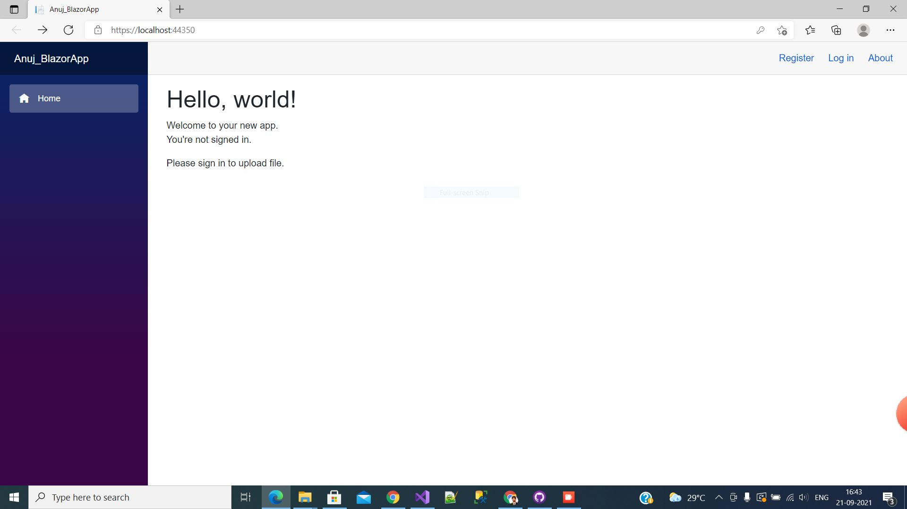
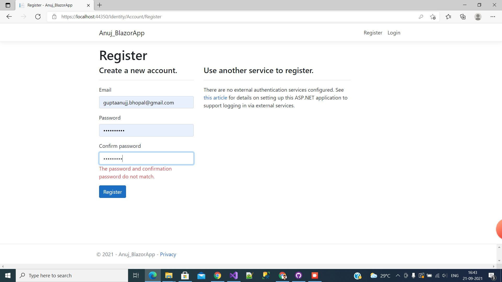
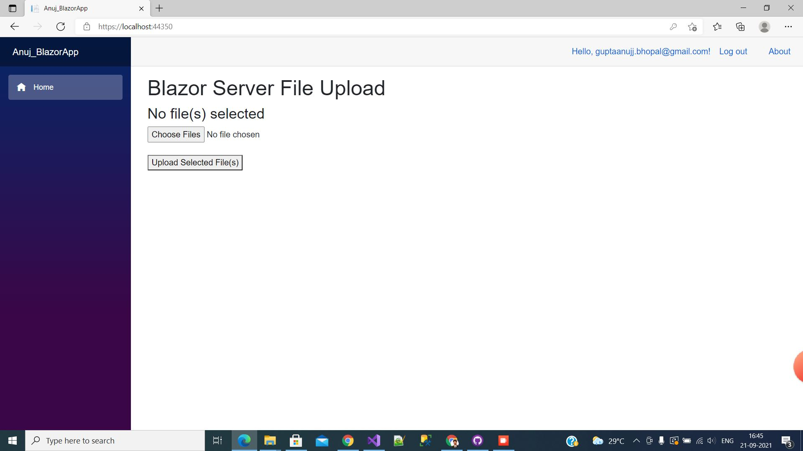
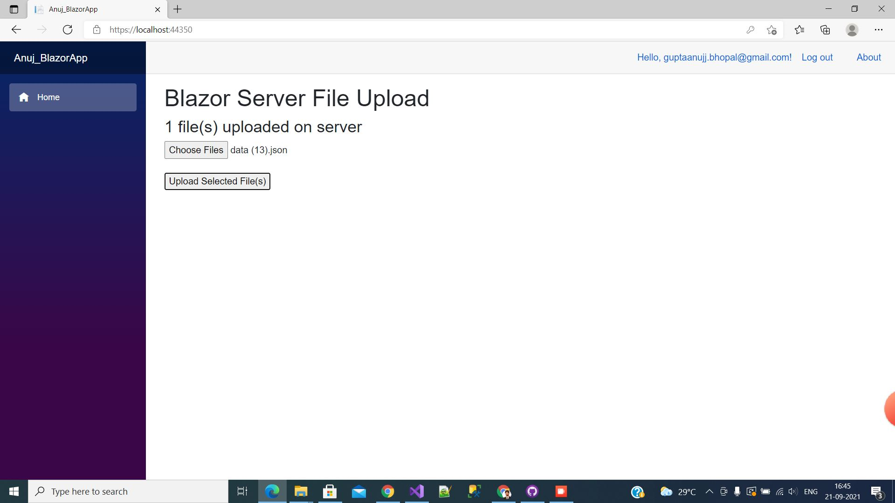
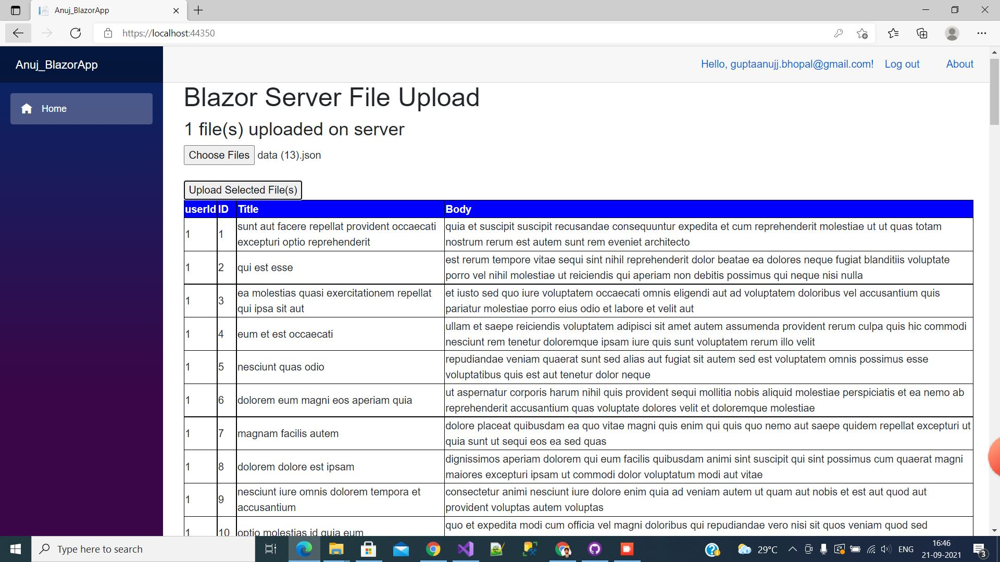

# FINANCEPEER PROJECT
## Machine Round

<h1 style="font-size:10vw">The user has to first register to login into the web application.</h1>
 

<h1 style="font-size:10vw">Then the user has to login into the application with his registered email and password.</h1>
 

<h1 style="font-size:10vw">If the user forgets his password he can reset his password or register as a new user.</h1>

 

<h1 style="font-size:10vw">Once the user logs into the application there will be an option to choose the JSON file and upload it on the database.</h1>

 

<h1 style="font-size:10vw">Then the user can view the uploaded JSON data in table format.</h1>

 

 
 
 
<h1 >ANUJ GUPTA</h1>

<h1 >18BCE10044</h1>
<a href="https://drive.google.com/file/d/10f5_8Qp6vQUT2-6FN_Fw5HUxpS3KnfCD/view?usp=sharing">RESUME LINK</a>
